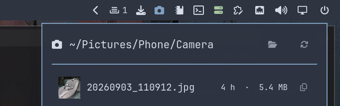

# Phone Photos



Your phone's latest photos and videos, one click away on the bar. Every row is
a drag handle, so a file goes straight into the upload field, chat window, file
manager, or editor that needs it.

The files are brought over by **Syncthing** from a phone (this was written for
a Samsung, but any Syncthing-capable phone works). The bar button carries a
badge counting the files that arrived since you last looked, so a fresh sync is
visible without opening anything.

## How it gets your files

This widget *reads* a local folder. It does not fetch from the cloud, and it
does not use the Google Photos API — which since March 2025 can no longer read
your existing library anyway. Instead the phone syncs its whole `DCIM` folder to
a directory on this machine, and the widget shows whatever is newest in the
`Camera` subfolder.

The sync is one-way and safe by construction:

| Side | Folder type | Why |
|---|---|---|
| Phone | **Send Only** | The phone is the source of truth |
| This machine | **Receive Only** | Nothing on the PC can damage the phone |

**Ignore Delete is off** (Syncthing's default). Deleting a photo on the phone
therefore also deletes your copy here. If you would rather keep a copy after
deleting on the phone you can tick **Ignore Delete** in the PC folder's
settings — but be aware each filtered deletion keeps the phone folder out of a
clean sync state (see [Troubleshooting](#troubleshooting--sync-hygiene)).

## Installing

```bash
omarchy plugin add https://github.com/nlboris/omarchy-phone-photos
omarchy plugin enable rob.phone-photos
omarchy bar move rob.phone-photos --section right
```

## Syncthing setup (one time)

On this machine, Syncthing runs as a user service:

```bash
sudo pacman -S syncthing
systemctl --user enable --now syncthing
```

The web UI is at `http://localhost:8384`.

On your phone, install **Syncthing-Fork** (Play Store or F-Droid), then:

1. Add this PC as a device (scan the QR code from the web UI, or paste this
   machine's device ID shown under *Actions → Show ID*).
2. Add a folder:
   - **Folder ID:** `phone-camera`
   - **Folder label:** `Camera`
   - **Folder path:** your phone's `DCIM` directory (this pulls everything
     under DCIM — `Camera`, `Screenshots`, `Videocaptures`, ...).
   - **Folder type:** Send Only
   - Share it with your PC.
3. On the PC web UI, accept the folder and point it at `~/Pictures/Phone`,
   folder type **Receive Only** (tick **Ignore Delete** only if you want
   deletions on the phone to keep a copy here — see the note above).
4. Set the widget to watch the camera subfolder in
   `~/.config/omarchy/shell.json`:

   ```json
   { "id": "rob.phone-photos", "folder": "/home/rob/Pictures/Phone/Camera" }
   ```

   Without this the widget shows everything under `DCIM`; this keeps it to the
   shots from the camera app.

Photos and videos start arriving as soon as both devices are on (the same
Wi-Fi, or over a WireGuard/Tailscale VPN when away).

## Make the popout behave like a popout

Optional but recommended. Without these rules the list tiles like any other
window; with them it floats under the bar on the right. Add to
`~/.config/hypr/hyprland.lua`:

```lua
o.window({ class = "^org.quickshell$", title = "^Phone Photos$" }, { tag = "-floating-window" })
o.window({ class = "^org.quickshell$", title = "^Phone Photos$" }, { float = true })
o.window({ class = "^org.quickshell$", title = "^Phone Photos$" }, { size = { 520, 700 } })
o.window({ class = "^org.quickshell$", title = "^Phone Photos$" }, { move = { "(monitor_w-window_w-2)", 48 } })
```

Then `hyprctl reload`. Match on the title as well as the class:
`org.quickshell` is every window the shell owns. The `size` rule pins the
window to a fixed box so the list really does float under the bar without
jumping to some remembered size.

### A key for it

```lua
o.bind("SUPER + P", "Phone Photos", "omarchy-shell shell toggle rob.phone-photos")
```

## Using it

| | |
|---|---|
| Click the bar button | open and close the list |
| Right-click the bar button | open the photo folder in your file manager |
| Click a row | open the file in its default viewer |
| Click the copy icon on a row | copy the file itself to the clipboard (`text/uri-list`) so you can paste it into a chat or editor |
| Drag a row | hand the file to whatever is under the cursor |
| Click the sync icon in the header | ask Syncthing to rescan the folder right now |
| `Esc` | close |

The badge counts files that are newer than the last time you opened the widget
or the folder, and that count persists across shell restarts — files you have
already seen stay seen.

New files are picked up **instantly** when the footer toggle *Instant sync
(watch for new photos)* is on — it flips on Syncthing's filesystem watcher for
the folder. With that toggle off (the default) files arrive on the folder's
**hourly** rescan, so if you have just taken something, hit the **sync icon**
in the header to bring it in immediately instead of waiting for the hour.

## Settings

Set these on the plugin's entry in `~/.config/omarchy/shell.json`:

| Setting | Default | What it does |
|---|---|---|
| `folder` | `~/Pictures/Phone` | The folder the widget lists (e.g. the `Camera` subfolder), as a plain path |
| `maxRows` | `200` | How many files the list shows |

```json
{ "id": "rob.phone-photos", "folder": "/home/rob/Pictures/Phone/Camera", "maxRows": 50 }
```

## What it does not do

- **It is not a backup.** Syncthing replicates; it does not keep version history.
  Treat `~/Pictures/Phone` as the thing you still back up.
- **The list caps at `maxRows`.** The window says what it left out rather than
  pretending the folder is smaller than it is.
- **The badge is "new since you looked", not "new since it synced".** It counts
  files newer than when you last opened the widget or the folder.
- **It reads, it never uploads.** Anything you want in Google Photos still goes
  through the Google Photos app on the phone.

## Troubleshooting & sync hygiene

Things learned the hard way, so you do not have to repeat the unforgiving
version.

### Amber folder switch next to "If untrusted, enter encryption password"

On the phone's **Devices** tab, a folder shared with a *trusted* device and no
encryption password shows an amber switch with that caption. This is an
**informational label**, not an error: it means the folder is synced in
plaintext (still TLS-encrypted in transit, but readable at rest on the PC).
There is nothing to fix; it stays amber by design. Making it "go away" would
mean marking the PC untrusted and adding an encryption password, which would
make the photos unreadable here.

### Phone reports "Up to date" but shows 98% / amber

If the PC side is genuinely clean (folder *idle*, `needFiles 0`,
`receiveOnlyChangedFiles 0`), a phone stuck on 98% with an amber Devices-tab
switch is a cosmetic/stale display. Force a rescan from the folder menu or
restart the app; the percentages do not track anything functional in that
case.

Two real causes produce an amber/98% that *is* actionable:

- **PC has Ignore Delete on.** Deletes on the phone become undeliverable to a
  receive-only PC, so the phone never reaches "fully synced". Untick the box
  (or keep it and accept the phone will show out of sync after each
  deletion).
- **Files edited on the PC.** Editing inside `~/Pictures/Phone` (rotating in
  `imv` with `Ctrl-R`, etc.) marks files as `receiveOnlyChanged`: they are
  local edits a receive-only folder cannot send back. The folder turns amber
  and never completes until the edits are gone.

### Fixing local edits in a receive-only folder

`revert` throws away the local differences and brings the folder back to the
phone's version. It is destructive to those edits — copy them somewhere else
first if you want to keep them:

```bash
API_KEY=$(grep -oP '(?<=<apikey>).*?(?=</apikey>)' \
    ~/.local/state/syncthing/config.xml)
curl -X POST -H "X-API-Key: $API_KEY" \
    'http://127.0.0.1:8384/rest/db/revert?folder=phone-camera'
```

Check the change before and after with the web UI: *Out of sync / Out of
sync items* should drop to zero. If you *want* local edits (thumbnails,
rotation, captions) to propagate back to the phone, change the PC folder to
**Send & Receive** instead.

## Removing it

```bash
omarchy plugin remove rob.phone-photos
```

**Things it leaves behind** (all removable by hand):

- the entry in `~/.config/omarchy/shell.json`
- the Hyprland rules from the popout section, if you added them
- the state file `~/.config/omarchy-phone-photos/seen.txt`, which holds the
  "last seen" timestamp — delete it to reset the badge
- the synced files in `~/Pictures/Phone`

## Privacy

Photos and videos never leave your machine once Syncthing has delivered them. The widget
reads a local directory through Qt's folder model and a short-lived helper; it
makes no network requests of its own. Filenames are rendered as `Text.PlainText`
throughout, so a file named to look like markup cannot make the shell fetch a
remote image.

## Acknowledgements

This widget was built with [opencode](https://opencode.ai), an open-source AI
coding assistant, under Rob's direction.

## License

MIT — see [LICENSE](LICENSE).
